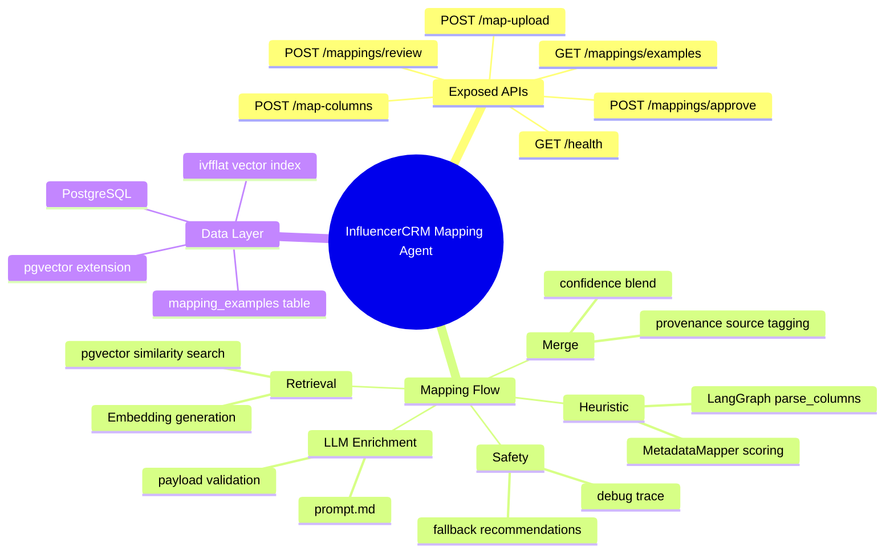
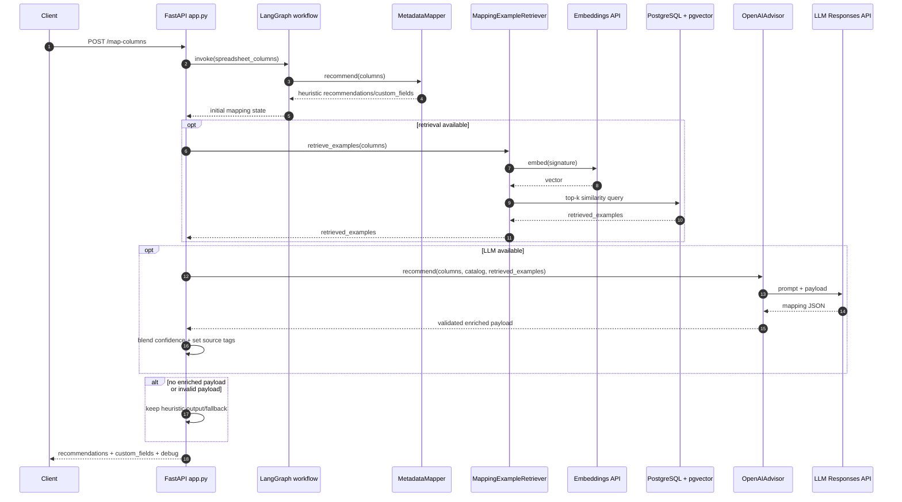

# InfluencerCRM Mapping Agent - Detailed Design

## 1. Purpose

The Mapping Agent provides API endpoints to map arbitrary marketer spreadsheet structures into the InfluencerCRM product model. It combines:

- deterministic heuristic mapping
- optional retrieval of similar historical mappings from pgvector
- optional LLM-based recommendation enrichment
- confidence blending, review tagging, and fallback safety

## 2. Scope

This design covers the Python agent service in agent_service and its dependencies on PostgreSQL/pgvector.

Included:

- request ingestion for column lists and file uploads
- heuristic mapping workflow
- retrieval-augmented recommendation flow
- LLM output validation and confidence blending
- response debug/provenance instrumentation

Not included:

- UI behavior
- asynchronous job orchestration
- persistent write-back of accepted mappings (future enhancement)

## 3. Runtime Stack

- Python 3.x
- FastAPI
- LangGraph
- OpenAI API (responses + embeddings)
- PostgreSQL + pgvector
- psycopg

## 4. High-Level Architecture

1. API Layer (FastAPI)
   - exposes /health, /map-columns, /map-upload
   - exposes /mappings/examples, /mappings/review, /mappings/approve
2. Workflow Layer (LangGraph)
   - one-node graph that invokes heuristic mapping
3. Heuristic Layer (MetadataMapper)
   - alias- and similarity-based metadata matching
4. Retrieval Layer (MappingExampleRetriever)
   - optional nearest-neighbor lookup from mapping_examples via pgvector
5. LLM Layer (OpenAIAdvisor)
   - optional enrichment using prompt.md and retrieved examples
6. Merge and Safety Layer
   - confidence blending
   - payload validation
   - fallback behavior
   - debug telemetry in response

## 5. Project Structure

```text
agent_service/
  app.py                 # FastAPI entrypoint and orchestration
  langgraph_workflow.py  # graph build and invoke wiring
  mapping_service.py     # heuristic recommendation engine
  llm_service.py         # LLM calls, payload validation, confidence blending
  retrieval_service.py   # pgvector retrieval of similar examples
```

## 6. API Design

### 6.1 Endpoint design principles

The agent endpoints are intentionally synchronous and stateless.

Design rules:

- request scope is a single mapping or review action
- no background jobs or callbacks are required for current flows
- file upload endpoints extract only header structure and do not persist uploaded files
- retrieval and LLM enrichment are best-effort enhancements; deterministic heuristic output remains the baseline contract
- review endpoints are allowed to degrade into a structured error payload instead of raising transport-level failures when persistence is unavailable
- no authentication or tenant boundary is enforced in the current agent service; callers must treat it as an internal service until auth is added

### 6.2 Endpoint matrix

| Method | Path | Purpose | Primary caller | Notes |
| --- | --- | --- | --- | --- |
| GET | /health | Liveness probe | platform/runtime | no dependencies |
| POST | /map-columns | Map raw column names into CRM attributes | UI/BFF/internal tools | core synchronous mapping endpoint |
| POST | /map-upload | Accept upload and delegate to /map-columns | UI/internal tools | parses first row only |
| GET | /mappings/examples | Read prior approved examples | review UI/internal tooling | best-effort DB-backed |
| POST | /mappings/review | Persist approval or rejection | ops review flow | can return status:error payload |
| POST | /mappings/approve | Approval convenience wrapper | ops review flow | wraps /mappings/review |

### 6.3 GET /health

Returns service liveness.

Characteristics:

- zero input
- no database dependency
- safe for load balancers and container probes

Response:

```json
{"status": "ok"}
```

### 6.4 GET /mappings/examples

Returns recent mapping examples persisted in PostgreSQL/pgvector-backed table.

Query params:

- limit (int, optional, default 20, max 200)
- active_only (bool, optional, default true)
- template_name (string, optional)

Response includes:

- status
- count
- items[]

Item fields returned from storage layer typically include:

- id
- template_name
- source_signature
- quality_score
- usage_count
- is_active
- created_at
- updated_at
- mappings

Error response includes:

- status: error
- reason
- error

Operational note:

- this endpoint does not raise an HTTP 5xx when the database lookup fails; it returns a structured status:error body with an empty items array so review tooling can degrade gracefully

### 6.5 POST /map-columns

Maps raw spreadsheet columns.

Request validation:

- spreadsheet_columns is required
- spreadsheet_columns must not be empty

Execution flow:

1. invoke LangGraph heuristic workflow
2. optionally retrieve similar historical examples
3. optionally request LLM enrichment
4. blend confidence by spreadsheet_column key
5. mark low-confidence recommendations for operator review
6. return debug/provenance block

Request:

```json
{
  "spreadsheet_columns": ["Campaign Name", "IG Handle", "Post URL"]
}
```

Response includes:

- recommendations
- custom_fields
- metadata_catalog
- debug

Recommendation object shape:

- spreadsheet_column
- target_entity
- target_attribute
- confidence
- recommendation_type
- notes
- source

Debug object shape:

- llm_available
- retrieval_available
- retrieved_examples_count
- llm_enhanced
- fallback_used
- recommendation_count
- review_candidates
- review_trace

Error response:

- HTTP 400 when spreadsheet_columns is empty

### 6.6 POST /map-upload

Accepts CSV/XLSX upload, extracts header columns, then delegates to /map-columns logic.

Upload parsing rules:

- CSV: parsed from first row using Python csv reader
- XLSX: parsed from first worksheet first row using openpyxl
- XLS: explicitly rejected with conversion guidance

Implementation notes:

- only header extraction happens here; row data is not returned
- this endpoint returns the same response contract as /map-columns after extraction

Rules:

- CSV supported
- XLSX supported
- XLS rejected with conversion hint

Error response:

- HTTP 400 for unsupported extension
- HTTP 400 for empty upload
- HTTP 400 when no columns extracted
- HTTP 500 when openpyxl is unavailable for XLSX handling

### 6.7 POST /mappings/review

Persists a review decision for a mapping payload.

Request contract:

- spreadsheet_columns
- recommendations[]
- approved
- approved_by
- template_name
- source_tab_names[]
- sample_values_json
- quality_score

Behavior:

- approved=true writes/updates active mapping example
- approved=false marks matching example inactive (if found)
- request with empty spreadsheet_columns returns HTTP 400

Response includes:

- status
- decision (approved | rejected)
- persistence object from storage layer

Persistence object may include:

- saved
- action
- id
- reason
- error

Design note:

- persistence failures are reflected in the JSON body with status:error rather than by converting every storage problem into an HTTP exception

### 6.8 POST /mappings/approve

Convenience endpoint for approved reviews only.

Behavior:

- internally calls /mappings/review flow with approved=true
- request shape matches /mappings/review except approved is implicit

## 7. Mapping Workflow

### 7.1 Heuristic pass

The workflow runs MetadataMapper.recommend and produces:

- mapped recommendations above threshold
- custom_fields for low-confidence/unknown attributes

Heuristic scoring uses:

- exact/normalized match
- alias map
- token overlap
- sheet-context boosts (for structured inputs)

### 7.2 Retrieval pass (optional)

Preconditions:

- DATABASE_URL set
- OPENAI_API_KEY set
- psycopg import available

Process:

1. Build source signature from incoming columns
2. Generate embedding
3. Query mapping_examples by vector similarity
4. Return top-k examples (RETRIEVAL_TOP_K)

### 7.3 LLM enrichment pass (optional)

Preconditions:

- OpenAI client available

Process:

1. Load system prompt from prompt.md
2. Send payload with columns, metadata catalog, retrieved examples
3. Validate strict JSON shape
4. Parse recommendation confidences

### 7.4 Merge and confidence blend

For each heuristic recommendation with LLM match on spreadsheet_column:

- blended_confidence = 0.6 * heuristic + 0.4 * llm
- source tagged as llm_enhanced

If no LLM match for a column:

- keep heuristic recommendation
- source tagged as heuristic

If enriched output unavailable/invalid:

- heuristic result preserved
- fallback path remains active if recommendations are empty

## 8. Response Contract

### 8.1 Transport behavior

- success mapping calls return HTTP 200
- successful review persistence returns HTTP 200
- malformed mapping input returns HTTP 400
- unsupported upload types return HTTP 400
- optional dependency failures in XLSX parsing return HTTP 500
- example/review persistence failures may still return HTTP 200 with status:error body, by design

Core fields:

- recommendations[]
- custom_fields[]
- metadata_catalog

Recommendation provenance:

- source: llm_enhanced | heuristic | fallback

Debug block:

- llm_available
- retrieval_available
- retrieved_examples_count
- llm_enhanced
- fallback_used
- recommendation_count
- review_candidates
- review_trace

## 9. Configuration

Environment variables:

- OPENAI_API_KEY
- OPENAI_MODEL (default gpt-4.1-mini)
- OPENAI_EMBEDDING_MODEL (default text-embedding-3-small)
- DATABASE_URL
- RETRIEVAL_TOP_K (default 3)
- REVIEW_THRESHOLD (default 0.7)

## 10. Data Model Dependencies

Required schema artifacts:

- users table (for optional mapping_examples.user_id FK)
- set_updated_at trigger function
- pgvector extension (vector)
- mapping_examples table and indexes from schema/mapping_examples_vector.sql

## 11. Reliability and Safety

- LLM output schema validation rejects malformed payloads
- retrieval failures return empty examples instead of hard failures
- heuristic path always available as deterministic fallback
- review trace captures low-confidence mappings for operator review

## 12. Performance Notes

- retrieval can reduce token usage by reusing prior patterns
- ivfflat index should be tuned after data grows
- initial warning about low recall on tiny tables is expected

## 13. Current Gaps and Next Steps

1. Add integration tests for retrieval + LLM merge paths
2. Add write-through telemetry for confidence drift over time
3. Support per-tenant retrieval filtering by user_id
4. Add endpoint authentication/authorization for review and examples APIs
5. Add idempotency key support for review submission calls
6. Add versioned API namespace if external consumers are introduced
7. Add structured correlation/request ids to endpoint responses and logs

## 15. Mind Map



## 16. Sequence Diagram



## 17. Contract Definitions (Exposed APIs)

### 17.1 GET /health

Success response:

```json
{
   "status": "ok"
}
```

### 17.2 GET /mappings/examples

Query params:

- limit: integer (1-200), optional, default 20
- active_only: boolean, optional, default true
- template_name: string, optional

Success response:

```json
{
   "status": "ok",
   "count": 1,
   "items": [
      {
         "id": "uuid",
         "template_name": "Shopify Creator Sheet",
         "source_signature": "Campaign Name | IG Handle | Post URL",
         "quality_score": 0.91,
         "usage_count": 4,
         "is_active": true,
         "created_at": "2026-07-17T20:00:00+00:00",
         "updated_at": "2026-07-17T20:05:00+00:00",
         "mappings": {
            "review": {"approved": true, "approved_by": "ops@brand.com"},
            "recommendations": []
         }
      }
   ]
}
```

Error response:

```json
{
   "status": "error",
   "reason": "database_unavailable",
   "error": null,
   "items": []
}
```

### 17.3 POST /map-columns

Request:

```json
{
   "spreadsheet_columns": ["Campaign Name", "IG Handle", "Review Notes", "Post URL"]
}
```

Success response shape:

```json
{
   "recommendations": [
      {
         "spreadsheet_column": "IG Handle",
         "target_entity": "creator",
         "target_attribute": "handle",
         "confidence": 0.95,
         "recommendation_type": "mapped",
         "notes": "...",
         "source": "llm_enhanced"
      }
   ],
   "custom_fields": [],
   "metadata_catalog": {},
   "debug": {
      "llm_available": true,
      "retrieval_available": true,
      "retrieved_examples_count": 2,
      "llm_enhanced": true,
      "fallback_used": false,
      "recommendation_count": 4,
      "review_candidates": [],
      "review_trace": []
   }
}
```

Error response (HTTP 400):

```json
{
   "detail": "spreadsheet_columns cannot be empty"
}
```

### 17.4 POST /map-upload

Request:

- multipart/form-data file field named file

Success response:

- same contract as POST /map-columns

Errors:

- HTTP 400 unsupported file extension
- HTTP 400 empty file
- HTTP 400 no columns found
- HTTP 500 XLSX parser dependency missing

### 17.5 POST /mappings/review

Request:

```json
{
   "spreadsheet_columns": ["Campaign Name", "IG Handle", "Post URL"],
   "recommendations": [
      {
         "spreadsheet_column": "IG Handle",
         "target_entity": "creator",
         "target_attribute": "handle",
         "confidence": 0.95,
         "recommendation_type": "mapped",
         "notes": "alias match",
         "source": "heuristic"
      }
   ],
   "approved": true,
   "approved_by": "ops@brand.com",
   "template_name": "Shopify Creator Sheet",
   "source_tab_names": ["Creators"],
   "sample_values_json": {},
   "quality_score": 0.93
}
```

Success response:

```json
{
   "status": "ok",
   "decision": "approved",
   "persistence": {
      "saved": true,
      "action": "inserted",
      "id": "uuid"
   }
}
```

Storage error response:

```json
{
   "status": "error",
   "decision": "approved",
   "persistence": {
      "saved": false,
      "reason": "database_error",
      "error": "..."
   }
}
```

### 17.6 POST /mappings/approve

Request:

- same as /mappings/review except approved is omitted and implied true

Success/error responses:

- same shape as /mappings/review

## 14. Local Run and Verification

Run tests:

```bash
python -m pytest -q
```

Run service:

```bash
uvicorn agent_service.app:app --reload
```

Sample mapping request:

```bash
curl -X POST http://localhost:8000/map-columns \
  -H "Content-Type: application/json" \
  -d '{"spreadsheet_columns": ["Campaign Name", "IG Handle", "Review Notes", "Post URL"]}'
```
