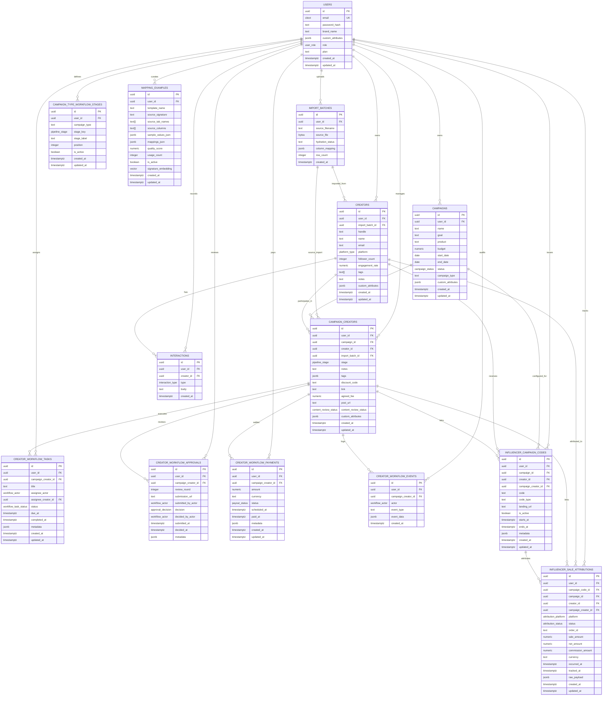

# Entity Relationship Diagram

This ER diagram is based on the schema defined in [schema/influencer_crm_schema.sql](influencer_crm_schema.sql).

## Notes

- Users are the top-level tenant owner for all records.
- Creators are owned by a user and may be imported from an import batch.
- Campaigns and creators are linked through the join table `campaign_creators` to track workflow stage, notes, fees, and links.
- Workflow setup is configured by campaign type in `campaign_type_workflow_stages`.
- Interactions store relationship memory such as notes, emails, or DMs attached to creators.
- Core entities include `custom_attributes` JSONB for unmapped import fields scoped by entity.
- Mapping examples are persisted for retrieval-augmented mapping reuse via pgvector similarity search.
- Attribution data ties influencer codes to tracked sales in `influencer_sale_attributions`.
